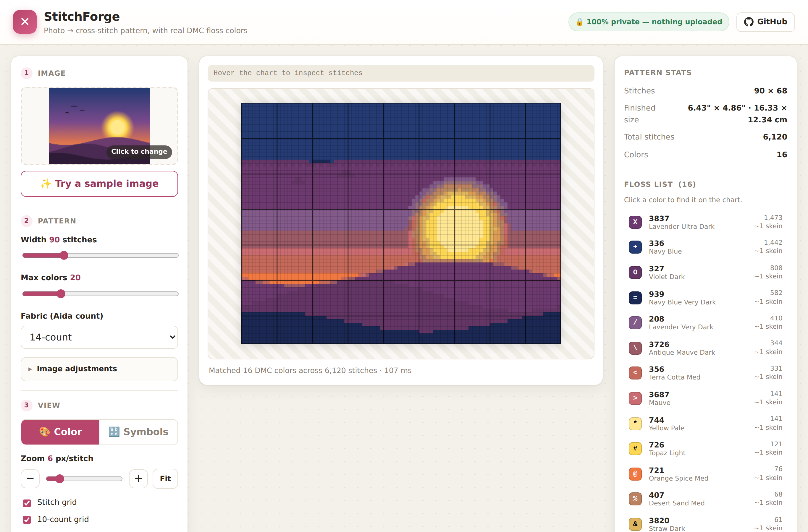
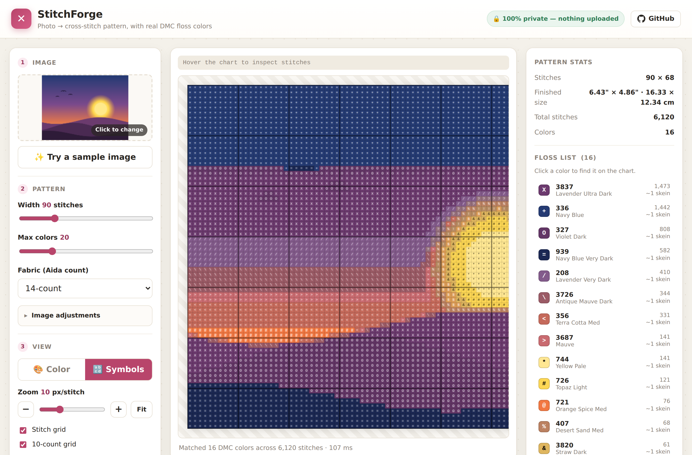
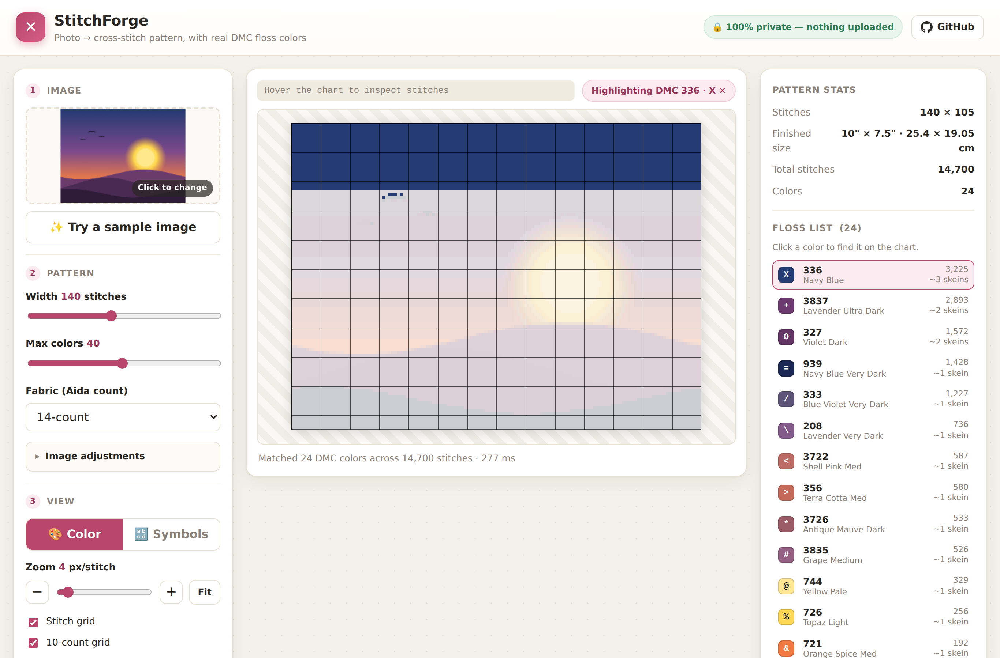
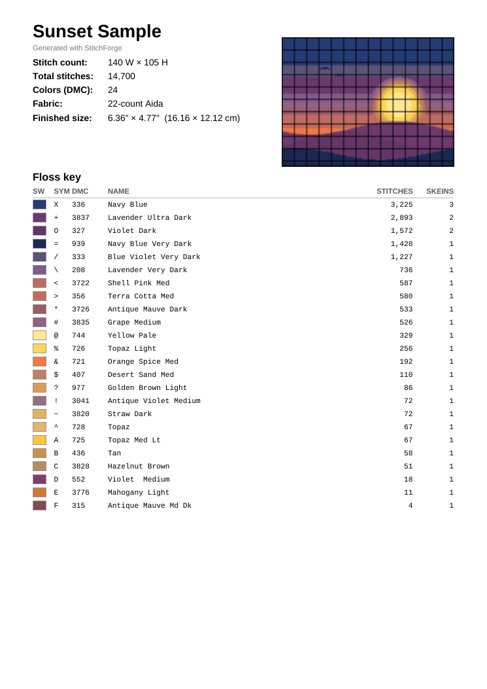
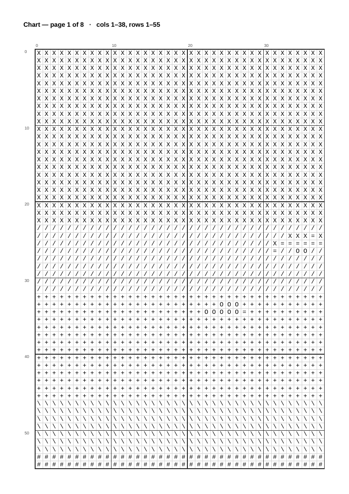

<div align="center">

# 🧵 StitchForge

### Turn any photo into a cross-stitch pattern — with *accurate* DMC floss colors, 100% in your browser.

**[▶ Live demo](https://skytuhua.github.io/stitch-forge/)** · No upload · No account · Works offline

</div>



---

## Why StitchForge?

If you've tried to turn a photo into a cross-stitch chart, you've met the two
bad options:

1. **Paid desktop software** (PCStitch, StitchFiddle Pro) — powerful but costs money.
2. **Free websites** — widely criticized for **poor color accuracy**, **size
   limits**, and **weak DMC floss matching**, usually wrapped in ads, and many
   make you **upload your photo to a server**.

StitchForge is the free option done properly:

- 🎯 **Color matching that's actually right.** Most free tools pick floss by
  naive RGB distance, which doesn't match how we see color (it'll confuse navy
  and dark green). StitchForge works in **CIELAB** and ranks every DMC floss by
  **CIEDE2000**, the CIE standard for perceptual color difference.
- 🔒 **Truly private.** Everything runs in your browser. Your image is never
  uploaded anywhere — there's no server at all.
- 🧶 **Real, stitchable output.** A symbol chart with 10-count grid lines, a
  floss shopping list (DMC code, name, swatch, stitch count, skein estimate),
  finished-size calculator, and a **print-ready multi-page PDF**.
- ⚡ **No size ceiling.** Heavy work runs in a Web Worker, so the UI stays smooth
  even on large patterns.

## Features

- Drag-and-drop image input (PNG / JPEG / WebP / GIF). Transparent areas become
  blank (unstitched) cells.
- Controls for **pattern width** (in stitches), **max colors** (up to 80), and
  **fabric Aida count** (11/14/16/18 or custom).
- **Image adjustments** — brightness, contrast, and saturation, applied before
  quantization so photos can be tuned to stitch well.
- **Color** preview and **Symbol** chart views, with adjustable zoom
  (−/Fit/+ and a slider) and stitch / 10-count grid overlays.
- **Click any floss to find it** — highlights every cell of that color on the
  chart and dims the rest.
- **Hover readout** — shows the stitch's row/column and its DMC floss as you
  move the cursor over the chart.
- Live **floss list** sorted by usage, **finished-size** in inches and cm, and
  total stitch / color counts.
- **PDF export** (cover + floss key + paginated symbol chart with coordinates),
  **PNG export** of the preview, and **CSV** floss/shopping-list export.
- Remembers your settings between visits; deterministic (same image + settings
  ⇒ same pattern).

## Screenshots

| Symbol chart | Find a floss on the chart |
|---|---|
|  |  |

| Printable PDF | |
|---|---|
|  | |

The exported PDF chart, ready to stitch from:



## How it works

```
image → downsample (linear-light) → cluster colors in CIELAB (k-means, CIE76)
      → map clusters to nearest DMC floss (CIEDE2000) → de-duplicate palette
      → reassign each cell to nearest floss in the palette (CIEDE2000)
      → symbol chart + floss list + PDF/PNG
```

Clustering uses fast CIE76 (it's just grouping); the **floss choices you
actually see** are made with perceptual **CIEDE2000**. The CIEDE2000
implementation is verified against the canonical Sharma/Wu/Dalal reference data
(`test/color.test.ts`). See [`ARCHITECTURE.md`](ARCHITECTURE.md) for the full
design.

## Run it locally

```bash
git clone https://github.com/Skytuhua/stitch-forge.git
cd stitch-forge
npm install
npm run dev          # http://localhost:5173
```

Other scripts:

```bash
npm run build        # type-check + production build into dist/
npm run preview      # serve the built app
npm test             # unit tests (Vitest)
npm run lint         # ESLint + Prettier check
npm run build:dmc    # regenerate the DMC color table from assets/dmc-source.json
```

### Headless QA (optional)

```bash
npm install -D playwright && npx playwright install chromium
npm run build && npm run preview &      # serve on :4173
node scripts/qa.mjs                     # drives the app, writes review/screenshots/
```

## Using the app

1. Drop in an image (or click **Try a sample image**).
2. Set the **width** in stitches and **max colors**. Pick your **fabric count**
   to see the finished size.
3. Switch between **Color** and **Symbols**, adjust zoom/grid.
4. Click **Download PDF** for a print-ready chart + floss list, or **Download
   PNG** for the preview.

## Limitations (v1)

- Full cross stitches only — no back-stitch, fractional stitches, or French knots.
- DMC floss only (no Anchor/Cosmo, no brand-to-brand conversion).
- Skein counts are a **rough estimate** (≈1500 stitches/skein, 2 strands on
  ~14-count). Buy a little extra.
- DMC RGB values are approximations of physical thread; a screen can't perfectly
  represent floss. Always check against a real shade card for critical work.

## License & attribution

- Code: **MIT** — see [`LICENSE`](LICENSE).
- DMC floss color data derived from
  [`seanockert/rgb-to-dmc`](https://github.com/seanockert/rgb-to-dmc) (factual
  reference data).
- StitchForge is an **independent project and is not affiliated with or endorsed
  by DMC**. "DMC" and floss color names/numbers are used nominatively only, to
  identify real thread for compatibility.
